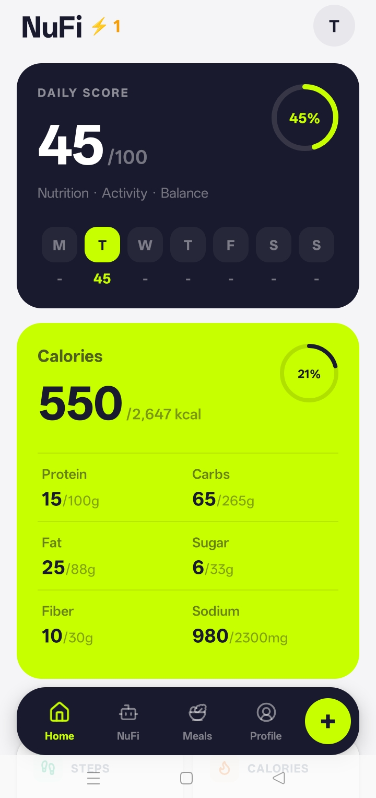
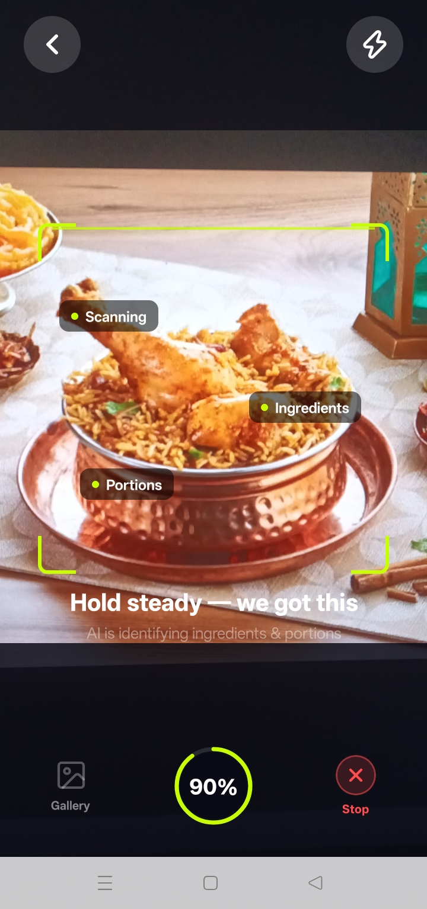
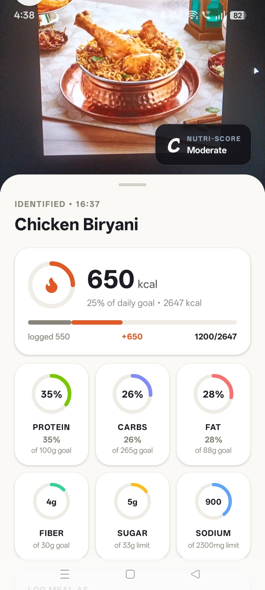
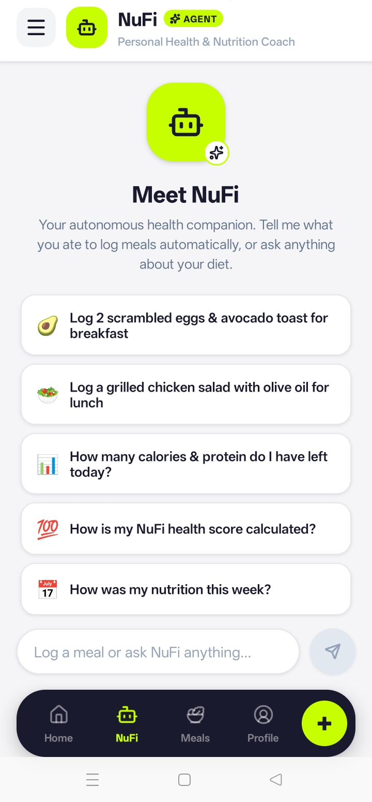

# NuFi — Smart Health Companion 🥗🤖📱

[](https://reactnative.dev/)
[](https://nodejs.org/)
[](https://expressjs.com/)
[](https://www.mongodb.com/)
[](https://ai.google.dev/)
[](https://mastra.ai/)
[](https://developer.android.com/health-and-fitness/guides/health-connect)

> **NuFi (Smart Health Companion)** is a full-stack, AI-first personal nutrition, fitness, and health companion. It combines **Google Gemini Vision** for instant food recognition, an autonomous **Mastra-powered AI Agent** for conversational meal logging and coaching, and native **Android Health Connect** synchronization across 18 biometric metrics into a cohesive mobile experience.

---

## 📸 Screenshots & Previews

> *Note: Place your screenshot files in `./screenshots/` with the corresponding filenames below.*

### 🥗 Diet, Vision Scanner & AI Chat
<p align="center">
  
  
  
  
</p>


---

## 🌟 Key Features

### 1. 📷 Multimodal AI Food Vision Scanner
- **Instant Photo Analysis**: Point your camera or pick a gallery image; powered by Google Gemini Vision (`gemini-3.5-flash-lite` / `gemini-3.6-flash`).
- **Comprehensive Macro & Micro Breakdown**: Accurately estimates Calories, Protein, Carbs, Fat, Fiber, Sugar, and Sodium.
- **Nutri-Score Rating (A–E)**: Automatically computes standardized dietary quality grades based on nutritional balance.
- **Non-Food Safety Filter**: Built-in guardrail detects non-edible objects (pets, keyboards, scenery) and prevents erroneous logging.

### 2. 🤖 NuFi Autonomous AI Nutrition Coach (Mastra Agent)
- **Conversational Meal Logging**: Say *"I had 2 boiled eggs and black coffee for breakfast"* — NuFi parses the items, calculates macros, calls `logMeal`, saves the record, and reports remaining daily budget.
- **Multi-Tool Autonomous Reasoning**: Equipped with 9 domain tools to read live targets, query historical meals, compute scores, and inspect Health Connect metrics.
- **Strict Domain Scope Guardrail**: Enforces dedicated wellness boundaries; gracefully declines off-topic requests (e.g., coding, general software questions) with a friendly redirect back to your health.
- **Smooth Animated Keyboard UI**: Custom pure React Native `Animated.Value` clearance mechanism that smoothly glides above Android's soft keyboard, predictive toolbar, and system navigation bar without lingering.

### 3. 🏃 Android Health Connect & Google Fit Integration
- **18 Read-Only Metrics**: Syncs Steps, Active Burned Calories, Total Energy, Resting Heart Rate, Heart Rate series, Sleep Sessions, Distance, Hydration, VO2 Max, and more.
- **Native Deduplicated Aggregation**: Uses Android Health Connect's native `aggregateRecord` for `Steps` to guarantee 100% alignment with Google Fit's official deduplicated total (`COUNT_TOTAL`), avoiding double-counting across smartwatches and phones.
- **Zero Inverted Window Errors**: Employs `operator: 'after'` time-range queries to completely eliminate `startTime must be before endTime` Android SDK exceptions.
- **Loop-Free Sync Architecture**: Throttled context syncing and dependency stabilization ensures smooth real-time updates without hammering the database.

### 4. 📊 Scientific Biometric Target & Health Score Engine
- **Mifflin-St Jeor BMR & TDEE Calculations**: Personalizes caloric targets according to height, weight, age, biological sex, and physical activity level.
- **Dynamic Daily Health Score (0–100)**: Multi-factor algorithm scoring caloric adherence, macronutrient balance, Nutri-Score quality, hydration, and physical activity.
- **Weekly Adherence Trends**: Visual progress bars and analytics comparing consumption vs. burn over 7-day rolling windows.

### 5. 🏥 Clinical Appointments & Specialist Directory
- **Specialist Browsing**: Browse clinical doctor profiles categorized by specialization, clinical experience, and ratings.
- **Dynamic Slot Picker**: Interactive day/time scheduling directly constrained to verified clinical hours.
- **Offline-First Resilience**: Automatically caches doctor listings and schedules locally using `AsyncStorage` to ensure availability during network interruptions.

### 6. 🛡️ Security, Privacy & Safety Guardrails
- **AES-256-GCM Field Encryption**: Biometric snapshots from Health Connect are encrypted at rest with initialization vectors and auth tags.
- **Explicit Biometric Consent**: Health Connect data is never queried or transmitted without explicit opt-in consent (`consentGiven: true`).
- **Data Freshness Guardrail**: Discards sensor records older than 30 days and transparently warns users if device data has not synced in over 24 hours.
- **Non-Diagnostic Safety**: AI responses are bounded by clinical safety rules — never prescribing medication or claiming diagnostic authority.

---

## 🏗️ Architecture & Data Flow

```
┌────────────────────────────────────────────────────────────────────────────────────────┐
│                                REACT NATIVE MOBILE APP                                 │
│                                                                                        │
│  ┌─────────────────────────┐  ┌──────────────────────────────────────────────────────┐  │
│  │   AuthStack (Public)    │  │                   AppStack                           │  │
│  │  - Login / Register     │  │  - FoodScannerScreen (Gemini Vision AI)              │  │
│  └─────────────────────────┘  │  - MealNutritionDetailScreen (Macro Confirmation)    │  │
│                               │  - ManualMealEntryScreen                             │  │
│  ┌────────────────────────────┴──────────────────────────────────────────────────────┤  │
│  │                    MainTabs (Stationary Bottom Navigation Dock)                   │  │
│  │  ┌──────────────────┬─────────────────┬─────────────────┬──────────────────────┐  │  │
│  │  │  DietDashboard   │  NuFi AI Chat   │   MealHistory   │   Profile & Targets  │  │  │
│  │  └──────────────────┴─────────────────┴─────────────────┴──────────────────────┘  │  │
│  └──────────────────────────────────────────┬─────────────────────────────────────────┘  │
│                                             │                                            │
│        ┌─────────────────┬──────────────────┴────────────────┬──────────────────┐        │
│        ▼                 ▼                                   ▼                  ▼        │
│  [AuthContext]     [DietContext]                  [HealthConnectContext]   [AppContext]  │
│  JWT & Sessions    Meals & Dashboard Cache        18 Biometrics Sync       Global State  │
└──────────────────────────┬───────────────────────────────────┬───────────────────────────┘
                           │                                   │
                           ▼                                   ▼
             ┌───────────────────────────┐       ┌───────────────────────────┐
             │    EXPRESS.JS BACKEND     │       │  ANDROID HEALTH CONNECT   │
             │                           │       │  - Steps (COUNT_TOTAL)    │
             │  /api/auth/* (JWT/Users)  │       │  - Active & Total Burn    │
             │  /api/diet/* (Meals/Logs) │       │  - Sleep & Heart Rate     │
             │  /api/chat   (Mastra AI)  │       │  - 18 Read-Only Metrics   │
             │  /api/health-connect (Enc)│       └───────────────────────────┘
             └─────────────┬─────────────┘
                           │
        ┌──────────────────┼──────────────────┐
        ▼                  ▼                  ▼
┌───────────────┐  ┌───────────────┐  ┌────────────────────────────────────────┐
│ MongoDB Atlas │  │ Gemini Vision │  │        Mastra AI Tool Engine           │
│ - Users       │  │ (3.5 / 3.6    │  │ - logMeal (Natural language meal log)  │
│ - MealLogs    │  │  Flash-Lite)  │  │ - getDietDashboard (Daily totals)      │
│ - Snapshots   │  └───────────────┘  │ - getHealthConnectSummary (Steps/Burn) │
│  (AES-256-GCM)│                     │ - getMealHistory (Historical logs)     │
└───────────────┘                     └────────────────────────────────────────┘
```

---

## 💻 Tech Stack

| Layer | Technologies |
| :--- | :--- |
| **Mobile Frontend** | React Native (0.78+), React Navigation, Vector Icons, Animated API, Axios, AsyncStorage |
| **Biometrics Integration** | `react-native-health-connect`, Google Fit APIs, Native Android Permissions |
| **Vision & Generative AI** | Google Gemini Vision (`@google/generative-ai`), Groq Llama 3.3 70B, Mastra Agent Framework |
| **Backend & APIs** | Node.js (v18+), Express.js, JWT, bcryptjs, crypto (AES-256-GCM) |
| **Database** | MongoDB Atlas with Mongoose Schemas & TTL indexing |

---

## 🛠️ Local Setup & Installation

### Prerequisites
- **Node.js** (v18 or higher recommended)
- **Android Studio** with Android SDK 34+ (or a physical Android phone with Health Connect installed)
- **MongoDB Atlas** database connection string
- **Google Gemini API Key** ([Google AI Studio](https://aistudio.google.com/))
- **Groq API Key** (optional / recommended for ultrafast chat inference: [Groq Console](https://console.groq.com/))

---

### 1. Backend Setup (Node.js & Express)

1. Open a terminal and navigate to the `server/` directory:
   ```bash
   cd server
   npm install
   ```

2. Create a `.env` file inside `server/` with the following variables:
   ```env
   PORT=3000
   MONGO_URI=mongodb+srv://<username>:<password>@cluster.mongodb.net/smarthealth?retryWrites=true&w=majority
   JWT_SECRET=your_jwt_secret_key_here
   GEMINI_API_KEY=your_gemini_api_key_here
   GROQ_API_KEY=your_groq_api_key_here
   ENCRYPTION_KEY=0123456789abcdef0123456789abcdef0123456789abcdef0123456789abcdef
   DEFAULT_TIMEZONE_OFFSET=-330
   ```

3. *(Optional)* Seed initial specialist doctor directory data:
   ```bash
   node seed.js
   ```

4. Start the backend server:
   ```bash
   node index.js
   ```

---

### 2. Mobile App Setup (React Native Android)

1. In the project root directory, install frontend dependencies:
   ```bash
   npm install
   ```

2. **Network Bridge for Physical Android Devices (via USB):**
   Run `adb reverse` so your Android phone can reach your local server and Metro bundler through `http://localhost`:
   ```bash
   adb reverse tcp:3000 tcp:3000
   adb reverse tcp:8081 tcp:8081
   ```

3. Start the React Native Metro bundler:
   ```bash
   npm run start -- --reset-cache
   ```

4. Launch the application on your connected Android device or emulator:
   ```bash
   npx react-native run-android
   ```

---

## 🛡️ Guardrails Summary

| Guardrail | Trigger / Condition | Action / Safe Behavior |
| :--- | :--- | :--- |
| **Domain Scope & Off-Topic** | User asks programming questions (e.g. reverse a string, write a script) | Politely declines and redirects the user back to health, diet, and fitness coaching. |
| **Non-Food Vision Filter** | User photographs a pet, object, or scenery | Returns `{ isFood: false }` and prompts the user to capture an edible meal. |
| **Biometric Non-Diagnostic** | User asks for medical diagnoses or drug prescriptions | Restricts response to sensor telemetry and reminds users to consult a doctor. |
| **Biometric Explicit Consent** | User has not granted Health Connect consent | Biometric tools return empty/blocked status with instructions to enable permissions in settings. |
| **Biometric Freshness** | Biometric records are older than 30 days or stale by >24h | Discards obsolete data and informs user of exact last-synced timestamp. |

---

## 📄 License
This project is developed for health companion purposes. Please ensure compliance with Google Health Connect Developer Policies and healthcare regulatory guidelines in your jurisdiction.
